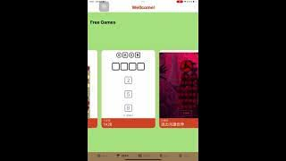

# SwiftUI_final_project
## 這是一個由七位成員共同開發的SwiftUI期末專題
#### 我們的專題概念是製作一個有許多小遊戲給玩家選擇的遊戲平台，其中又分成自由模式與故事模式。自由模式: 玩家可以自由選擇自己想要玩得遊戲 故事模式: 我們將小遊戲串接成一個破關遊戲，玩家須一直破關才能前往下一關 除此之外，我們還設有排行榜機制，可以看出大家最喜歡自由模式的那些小遊戲  設定: 可以更改頭像姓名，開啟關閉遊戲音樂，調整遊戲音量大小
#### 其中我們的工作分配為一人製作一個小遊戲，包含自由模式和故事模式，如下: 
##### Rebacca931=> 翻牌遊戲 美編 加入音樂
##### AmilyC=> 水果消消樂 排行榜 整合自由模式
##### mya2002=> 1A2B 數字炸彈 整合故事模式
##### RichHakka=> 貪食蛇
##### sunnyplaycode=> 接蘿蔔
##### didi816=> 圈圈叉叉 網頁跳轉功能
##### 匿名某同學=> 逃出月讀世界(打地鼠)
#### 詳細說明可以看[我們的簡報](https://github.com/AmilyC/SwiftUI_final_project/blob/main/swiftUIfinal.pdf)
# 自由模式的程式碼連結
## About 
[圈圈叉叉](https://github.com/AmilyC/SwiftUI_final_project/blob/main/ooxxView.md)
###
[翻牌遊戲](https://github.com/AmilyC/SwiftUI_final_project/blob/main/flipCardFree.md)
###
[貪食蛇](https://github.com/AmilyC/SwiftUI_final_project/blob/main/snakeView.md)
###
[數字炸彈](https://github.com/AmilyC/SwiftUI_final_project/blob/main/FreeGameBomb.md)
###
[水果消消樂](https://github.com/AmilyC/SwiftUI_final_project/blob/main/FreeGameFruit.md)
###
[1A2B](https://github.com/AmilyC/SwiftUI_final_project/blob/main/oneAtwoB.md)
###
[逃出月讀世界(打地鼠)](https://github.com/AmilyC/SwiftUI_final_project/blob/main/FreeGameBonk.md)
###
[接胡蘿蔔](https://github.com/AmilyC/SwiftUI_final_project/blob/main/FreeGameCarrot.md)
# 故事模式的程式碼連結
## About
[圈圈叉叉](https://github.com/AmilyC/SwiftUI_final_project/blob/main/ooxxstory.md)
###
[翻牌遊戲](https://github.com/AmilyC/SwiftUI_final_project/blob/main/Flipcard.md)
###
[貪食蛇](https://github.com/AmilyC/SwiftUI_final_project/blob/main/snakeStoryView.md)
###
[數字炸彈](https://github.com/AmilyC/SwiftUI_final_project/blob/main/Bomb.md)
###
[水果消消樂](https://github.com/AmilyC/SwiftUI_final_project/blob/main/Crash.md)
###
[1A2B](https://github.com/AmilyC/SwiftUI_final_project/blob/main/ab.md)
###
[逃出月讀世界(打地鼠)](https://github.com/AmilyC/SwiftUI_final_project/blob/main/bonk.md)
###
[接胡蘿蔔](https://github.com/AmilyC/SwiftUI_final_project/blob/main/catchFruit.md)
# 各個介面的程式碼連結
## About
[Welcome](https://github.com/AmilyC/SwiftUI_final_project/blob/main/welcome.md)
###
[自由模式](https://github.com/AmilyC/SwiftUI_final_project/blob/main/freeGameView.md)
###
[故事模式](https://github.com/AmilyC/SwiftUI_final_project/blob/main/storyView.md)
###
[排行榜](https://github.com/AmilyC/SwiftUI_final_project/blob/main/Trendview.md)
###
[設定](https://github.com/AmilyC/SwiftUI_final_project/blob/main/Setting.md)

# 整體操作影片

