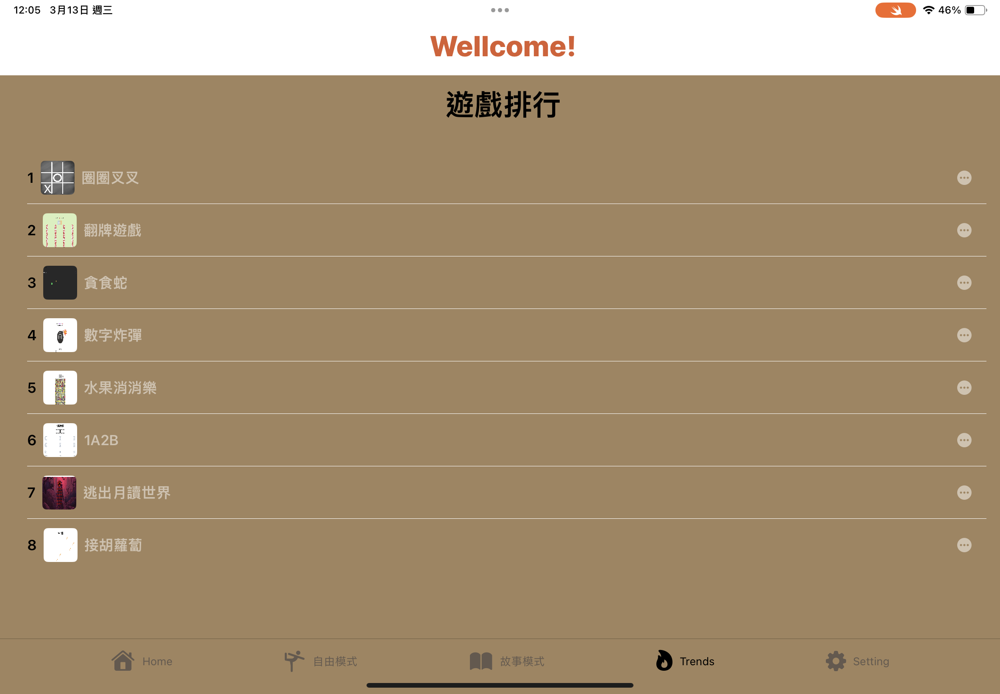

<h1>Trend</h1>
<h2>遊戲排行</h2>
<table>
  <tr>
   
    
      
 ```swift
  


import SwiftUI

struct TrendView: View {
    
    @State var showDetailView = false
    @State var selectCourse:GameInfo?//value may be empty
    //@AppStorage("trendNum") var trendNum:Int = 0
    @State var upDate: Bool = true
    
    //var sortedGames
    @AppStorage("trendNum") var trendNum = [0,0,0,0,0,0,0,0]
    @State var sortedGames:[GameInfo] = games
    func foo(){
        print(trendNum)
        print(sortedG())
    }
    
    func sortedG() -> [GameInfo]{
        let sortedIndices = trendNum.indices.sorted(by: {trendNum[$0] > trendNum[$1]})
        return sortedIndices.map{ games[$0]}
    }
    var body: some View {
        //
        // withIndex = courses.enumerated().map({$0})
        VStack{
            Text("")
            HStack{
                TitleView(text: "遊戲排行")
                
            }
//            .onAppear{
//                sortedGames=zip(games,trendNum).sorted{
//                    $0.1>$1.1}.map{ $0.0}
//            }
            
            
               NavigationView{
                //let descent = games.sorted()
                List(0..<sortedG().count, id:\.self){
                    index in
                    // Text()
                    
                    BasicImageRowForTrend(thisCourse: sortedG()[index],number: index+1)
                        .listRowBackground(Color.brown)
                        .listRowSeparatorTint(Color.white)
                        .onTapGesture {
                            //what happen will click the list
                          //  print(sortedGames[index].trendNum)
                          //  print(sortedGames[index].courseNameTW)
                            self.showDetailView=true
                            self.selectCourse=sortedG()[index]
                           // foo()
                            
                        }
                    
                    //BasicImageRow(thisRestaurant: restaurantItem)
                }
                .background(.brown)
                .scrollContentBackground(.hidden)
                .sheet(item: self.$selectCourse,content:{
                    thisCourse in
                    thisCourse.destinationView
                        .background(.brown)
                })
                
            }
             .navigationViewStyle(StackNavigationViewStyle())
        }

        .background(.brown)
        
        
        
    }
}
      
 ```
  
     </td>
 
  </tr>
</table>
