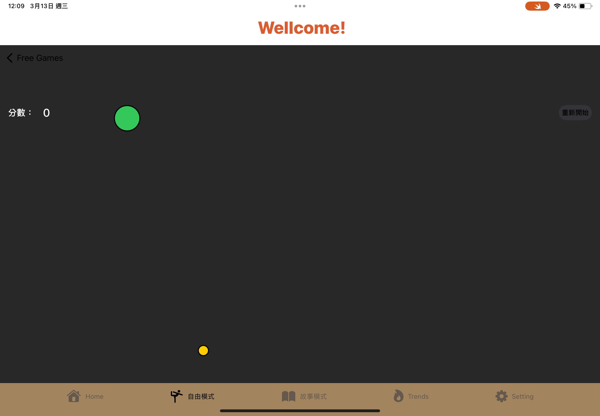

<h1>snakeview</h1>
<h2>貪吃蛇 自由模式</h2>
<table>
  <tr>
   
    
      
 ```swift
  

import SwiftUI
import Foundation
enum Directions{
    case up,down,left,right,null
}

struct snakeView: View {
    @State private var StartPosition: CGPoint = .zero
   
    @State private var positions = [CGPoint(x: 0,y: 0)]
    @State private var FoodPosition = CGPoint(x: 0,y: 0)
    
    @State private var isStarted=true
    @State var GameOver=false
    @State private var score = 0
    
    
    @State private var direction = Directions.null
    
    @AppStorage("trendNum") var trendNum = [0,0,0,0,0,0,0,0]
    
    let SnakeSize:CGFloat=50
    
    //let time = 0.16
    //@State var paratimer: Timer?
    

    let timer = Timer.publish(every: 0.12, on: .main, in: .common).autoconnect()
    var body: some View{
        ZStack{
            Color(red:40/255,green:40/255,blue:40/255).ignoresSafeArea()
            
            ZStack{
                VStack{
                    HStack{
                        HStack{
                            Text("分數： ").font(.headline)
                            Text("\(score)")
                                .font(.title2)
                                .fontWeight(.medium)
                        }
                        Spacer()
                        Button(action:{
                            Start()
                        },label:{
                            Text("重新開始")
                                .font(.footnote)
                                .fontWeight(.medium)
                                .foregroundColor(.black)
                                .frame(width: 65,height:30)
                                .background(Color.secondary)
                                .clipShape(RoundedRectangle(cornerRadius: 25))
                        })
                    }.padding()
                        .foregroundColor(.white)
                    Spacer()
                }
                ForEach(0..<positions.count,id:\.self){
                    index in
                    Circle()
                        .fill(Color.green)
                        .overlay(Capsule().stroke(Color.black,lineWidth: 2))
                        .frame(width:SnakeSize*1,height: SnakeSize*1)
                        .position(positions[index])
                }
                Circle()
                    .fill(Color.yellow)
                    .overlay(Capsule().stroke(Color.black,lineWidth:2))
                    .frame(width:SnakeSize/2.5,height:SnakeSize/2.5)
                    .position(FoodPosition)
            }.onAppear{
                withAnimation(.easeInOut){
                    FoodPosition=changePosition()
                    positions[0]=changePosition()
                    
                }
            }
        }
        .onAppear{
            trendNum[2] = trendNum[2]+1
           // games[2].trendNum+=1
        }
        .alert(isPresented:$GameOver)
        {
            Alert(title:Text("遊戲結束"),message:Text("你的得分 \(score)"),primaryButton:.default(Text("回到標題"),action:{
                GameOver.toggle()
                isStarted.toggle()
            }),secondaryButton: .default(Text("重新開始"),action:{
                Start()
            }))
        }
        .gesture(
            DragGesture()
                .onChanged{gesture in
                    if isStarted{
                        withAnimation{
                            StartPosition=gesture.location
                            isStarted.toggle()
                        }
                    }
                }
                .onEnded{ gesture in
                    let DistanceX=abs(gesture.location.x-StartPosition.x)
                    let DistanceY=abs(gesture.location.y-StartPosition.y)
                    
                    if StartPosition.y<gesture.location.y && DistanceY>DistanceX && direction != Directions.up
                    {
                        direction=Directions.down
                    }
                    else if StartPosition.y>gesture.location.y && DistanceY>DistanceX && direction != Directions.down
                    {
                        direction=Directions.up
                    }
                    else if StartPosition.x<gesture.location.x && DistanceY<DistanceX && direction != Directions.right
                    {
                        direction=Directions.left
                    }
                    else if StartPosition.x>gesture.location.x && DistanceY<DistanceX && direction != Directions.left
                    {
                        direction=Directions.right
                    }
                    isStarted.toggle()
                }
        )
        
        .onReceive(timer)
        {
            time in if !GameOver{
                withAnimation(.linear(duration:0.16))
                {
                    
                    changeDirection()
                }
                if positions[0]==FoodPosition
                //if(abs(positions[0].x-FoodPosition.x))*(abs(positions[0].y-FoodPosition.y))<=2
                    {
                    withAnimation(.smooth()){
                        positions.append(positions[0])
                    }
                    FoodPosition=changePosition()
                    score += 1
                }
            }
        }
    }
    let minX=UIScreen.main.bounds.minX
    let maxX=UIScreen.main.bounds.maxX
    let minY=UIScreen.main.bounds.minY
    let maxY=UIScreen.main.bounds.maxY
    
    func changePosition()->CGPoint{
        let row = Int(maxX/SnakeSize)
        let col = Int(maxY/SnakeSize)
        let randomX = Int.random(in:1..<row-2)*Int(SnakeSize)
        let randomY = Int.random(in:1..<col-2)*Int(SnakeSize)
        
        let randomPosittion = CGPoint(x:randomX,y:randomY)
        return randomPosittion
    }
    
   /* func restartTimer(){
        let buff = 0.2 - Double(score/100)
        let TimerBuff = TimeInterval(buff) 
        let paratimer = Timer.publish(every: TimerBuff, on: .main, in: .common)
    } */
    
    func changeDirection(){
        if positions[0].x < minX || positions[0].x > maxX && !GameOver{
            GameOver.toggle()
        }
        else if positions[0].y < minY || positions[0].y > maxY && !GameOver{
            GameOver.toggle()
        }
        
        var prev = positions[0]
        let speedbonus = CGFloat(0)
        if direction == .null{
            positions[0].x += 0  
        }
        else if direction == .down{
            positions[0].y += (SnakeSize + speedbonus)
        }
        else if direction == .up{
            positions[0].y -= (SnakeSize + speedbonus)
        }
        else if direction == .left{
            positions[0].x += (SnakeSize + speedbonus)
        }else {
            positions[0].x -= (SnakeSize + speedbonus)
        }
        
        for index in 1..<positions.count{
            
            let current = positions[index]
            positions[index]=prev
            prev = current
            
        }
        if (positions.count > 5)
        {
            for index in 3..<positions.count{
                if ( positions[index] == positions[0])
                {
                    GameOver.toggle()
                }
            }
        }
        
    }
    
    func Start()
    {
        withAnimation(.easeInOut){
            score = 0
            positions=[CGPoint(x: 0, y:0)]
            GameOver=false
            isStarted=true
            direction = .null
            FoodPosition=changePosition()
            positions[0]=changePosition()
            changeDirection()
        }
    }
}

      
 ```
  
     </td>
 
  </tr>
</table>
